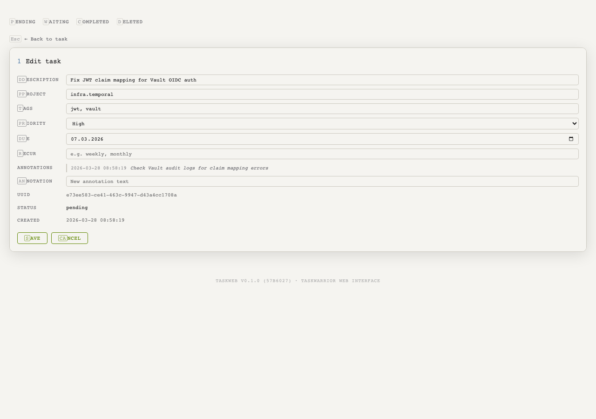

# TaskWeb

A web interface for [Taskwarrior 3](https://taskwarrior.org/).

## Screenshots

### Light Mode


### Dark Mode


### Task Detail


### Task Edit



### Completed Tasks


## Features

- View pending tasks sorted by urgency
- Add new tasks with project, tags, priority, and due date
- Complete and delete tasks
- Full task editing (description, project, tags, priority, due, recur, annotations)
- Task detail view with annotations
- Filter by project or tag
- View completed and deleted tasks
- Pagination (40 tasks per page)
- Light/dark mode with system preference detection
- Responsive design

## Quick Start

```console
taskweb serve
```

Or with custom host/port:

```console
taskweb serve --host 127.0.0.1 --port 8080
```

## Configuration

TaskWeb reads from your Taskwarrior 3 configuration by default. You can override the data location with environment variables:

```console
export TASKDATA=~/.local/share/task
export TASKRC=~/.config/task/taskrc
```

A demo database with sample tasks is included in `data/` for development.

## Development

```console
# Enter nix dev shell
just dev

# Run tests
just test

# Format code
just format

# Start dev server
just serve
```

## Stack

- Python 3.10+
- Flask
- Taskwarrior 3 (direct SQLite access)
- Nix flakes for development environment

## License

MIT

