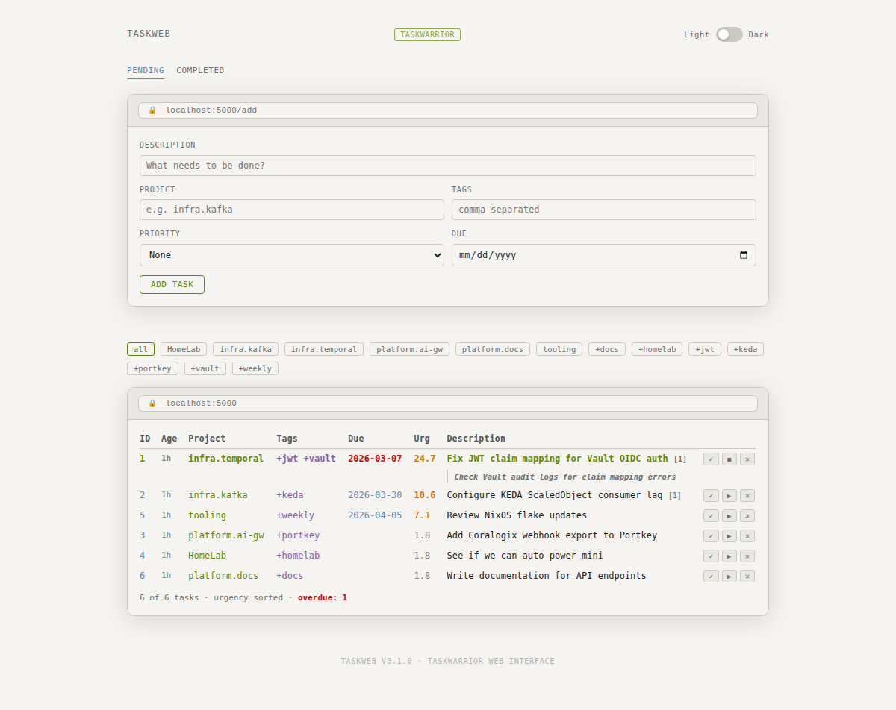
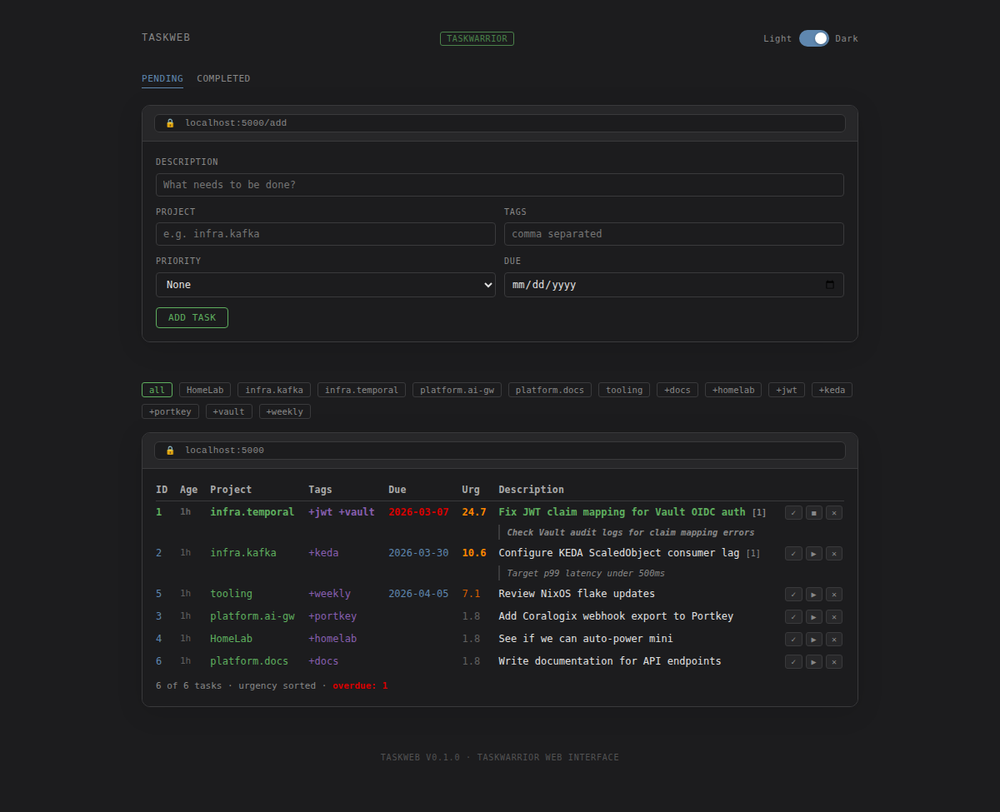

# TaskWeb

A web interface for [Taskwarrior](https://taskwarrior.org/).

## Screenshots

### Light Mode


### Dark Mode


### Annotations (Light)



### Annotations (Dark)



### Completed Tasks


## Features

- View pending tasks sorted by urgency
- Add new tasks with project, tags, priority, and due date
- Complete, start/stop, and delete tasks
- Filter by project or tag
- View completed tasks
- Light/dark mode with system preference detection
- Responsive design

## Quick Start

```sh
make serve
```

Or with custom host/port:

```sh
python -m taskweb serve --host 0.0.0.0 --port 8080
```

## Configuration

TaskWeb reads from your system Taskwarrior configuration by default. You can override the data location with environment variables:

```sh
export TASKRC=./data/taskrc
export TASKDATA=./data/task
```

A local development database is included in `data/` for testing.

Example config in `configs/example.yaml`.

## Development

```sh
# Enter nix dev shell
make dev

# Run tests
make test

# Format code
make format

# Start dev server
make serve
```

## Stack

- Python 3.10+
- Flask
- Taskwarrior (via subprocess)
- Nix flakes for development environment

## License

MIT

## Repository Setup

After creating the repository on GitHub:

1. Set the default branch to `main`:
   ```sh
   gh repo edit ivankovnatsky/taskweb --default-branch main
   ```

2. Make the repository private:
   ```sh
   gh repo edit ivankovnatsky/taskweb --visibility private
   ```
