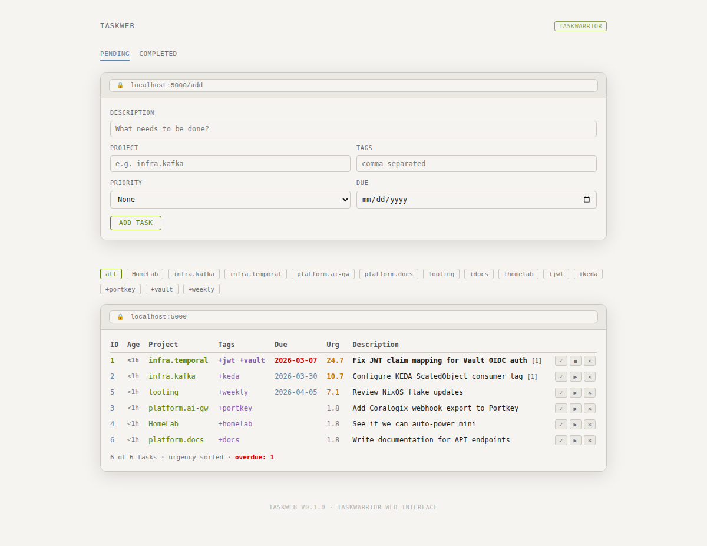
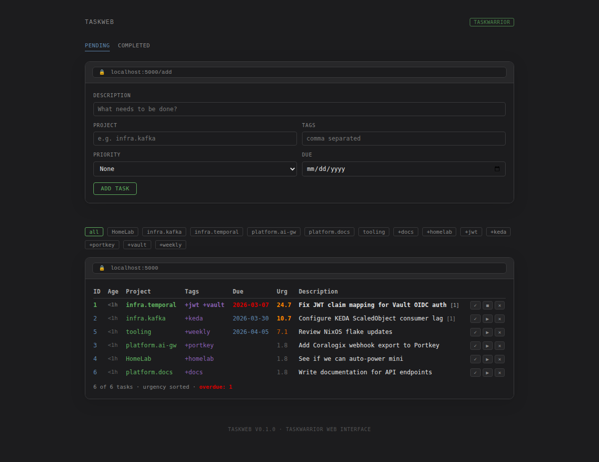
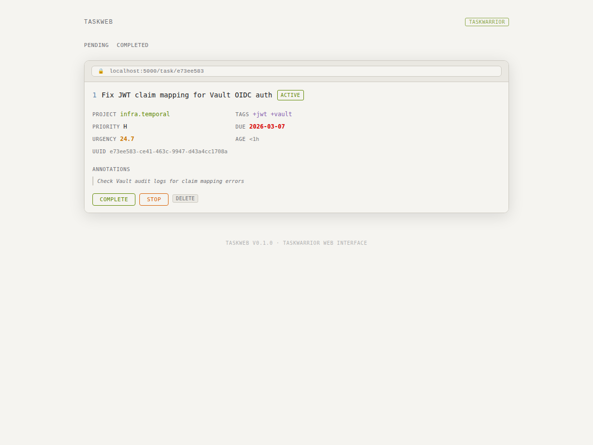
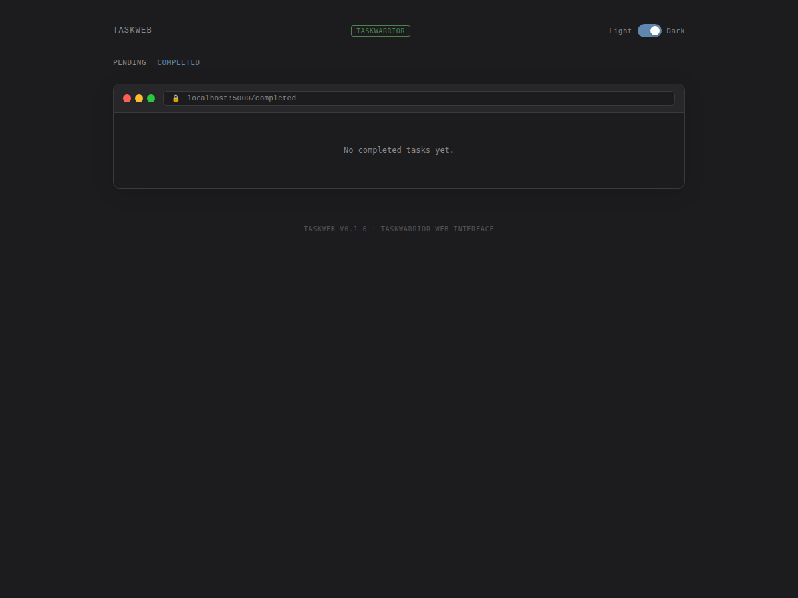

# TaskWeb

A web interface for [Taskwarrior 3](https://taskwarrior.org/).

## Screenshots

### Light Mode



### Dark Mode



### Task Detail



### Completed Tasks



## Features

- View pending tasks sorted by urgency
- Add new tasks with project, tags, priority, and due date
- Complete, start/stop, and delete tasks
- Task detail view with annotations
- Filter by project or tag
- View completed tasks
- Light/dark mode with system preference detection
- Responsive design

## Quick Start

```console
taskweb serve
```

Or with custom host/port:

```console
taskweb serve --host 127.0.0.1 --port 8080
```

## Configuration

TaskWeb reads from your Taskwarrior 3 configuration by default. You can override the data location with environment variables:

```console
export TASKDATA=~/.local/share/task
export TASKRC=~/.config/task/taskrc
```

A demo database with sample tasks is included in `data/` for development.

Example config in `configs/example.yaml`.

## Development

```console
# Enter nix dev shell
task dev

# Run tests
task test

# Format code
task format

# Start dev server
task serve
```

## Stack

- Python 3.10+
- Flask
- Taskwarrior 3 (via subprocess)
- Nix flakes for development environment

## License

MIT

## Repository Setup

After creating the repository on GitHub:

1. Set the default branch to `main`:
   ```console
   gh repo edit ivankovnatsky/taskweb --default-branch main
   ```

2. Make the repository private:
   ```console
   gh repo edit ivankovnatsky/taskweb --visibility private
   ```
